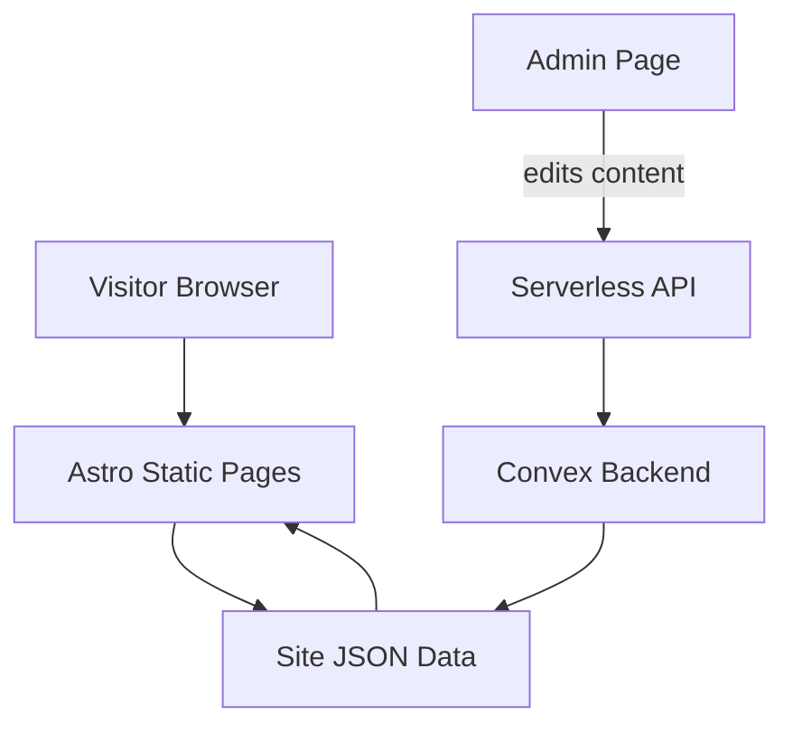

# Blueprint: savvautops/site-heinzschielmann

_Auto-generated architectural documentation — 2026-09-24 (Phase 1). Built from the repository file tree, README and manifests._

## Diagram

## How it works

site-heinzschielmann is a retro pixel-sorting art portfolio and creative-tech site built with Astro 4 and Tailwind. The public face is static pages (`src/pages/index.astro`) rendered from a data file (`src/data/site.json`) that holds the portfolio content.

What makes it more than a static site is the editing loop: an `admin.astro` page provides a browser-based editor that writes through a serverless API (`functions/api/content.js`) into a Convex backend. Content changes land in Convex, get reflected into `site.json`, and the next build bakes them into the static pages. Convex (`convex` dependency) is the live database behind the CMS-like workflow.

## Key files

- `src/pages/index.astro` — public portfolio page
- `src/pages/admin.astro` — browser content editor
- `src/data/site.json` — portfolio content data
- `functions/api/content.js` — serverless content API
- `astro.config.mjs` — Astro + Tailwind config
- `package.json` — Astro 4, Tailwind, Convex

## For the owner

This is a portfolio website for pixel-sorting art with a twist: instead of editing code to change the gallery, there is a hidden admin page where content can be updated through a real database (Convex) via a small API. The public site stays blazing-fast static pages, while edits flow through the backend. A neat pattern — static speed with CMS convenience.
